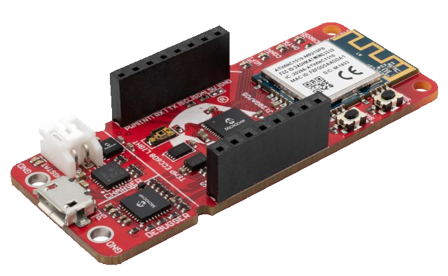
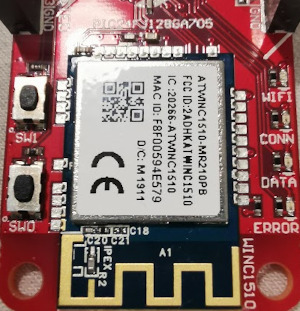

# Getting Started Guide: Microchip PIC-IoT  Mosquitto Application

Devices: \| **PIC24FJ128GA705(MCU)** \| **WINC1510(Wi-Fi®)** \|

---
## Summary
   + Connect to a custom (mosquitto or other) MQTT broker
   + This demo uses a simplified MCC based demo compared to the Microchip official Google or AWS preconfigured demo
   + Easier to reconfigure to your needs
   + ATECC crypto chip is not utilised. --> Therefore this is very vulnerable and totally not recommended for live usage, only for testing

## Quick start
### 1. Clone and open project in MPLAB X
### 2. Edit the config files:
   1. [**conf_winc.h**](pic-iot-mosquitto.X/mcc_generated_files/config/conf_winc.h) --> Wireless settings
      1. #define CFG_MAIN_WLAN_SSID "Your_WiFi_SSID"
      2. #define CFG_MAIN_WLAN_PSK "Your_WiFi_Password"
   2. [**mqtt_config.h**](pic-iot-mosquitto.X/mcc_generated_files/config/mqtt_config.h) --> mqtt config
      1. #define CFG_MQTT_PORT 1883 
      2. #define CFG_MQTT_HOSTURL "your.mosquittoserver.com"
      3. #define CFG_MQTT_USERNAME "broker_username"
      4. #define CFG_MQTT_PASSWORD "broker_password"
### 3. Compile and program
### 4. Verify
1. Use MQTTbox or other MQTT client
2. Subscribe to "topics/publish"
3. Monitor the publish messages coming from PIC-IoT board
4. Press SW0 on PIC-IoT boart to send other message than ping

## Serial terminal
+ Debug messages sent via USB-UART (CDC)
+ 9600 baud 8n1
   
## LED feedback:
+ **Blue/WIFI:** ON if WIFI is connected
+ **Green/CONN:** ON if MQTT client is connected to the broker
+ **Yellow/Data:** Blinks when a message sent to the broker 

## Requirements
   + Internet WIFI router or mobile Hot-Spot
   + MPLAB X and XC16 compiler
   + Micro USB cable
   + PIC-IoT board
   + Serial terminal (optional)

## Limitations
+ Subscribe is suppoerted, but not implemented in this demo
+ Manual ping message sending is used for keepalive (Bug: Auto PINGREQ does not work)

